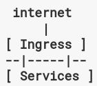
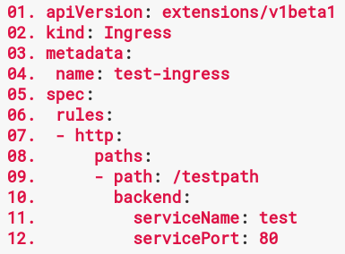
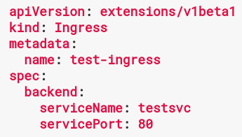
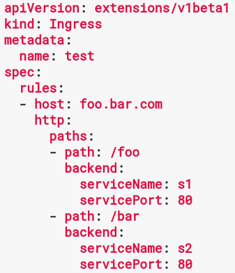

# Ingress Resources

- [What is Ingress ?](#What is Ingress ?)
- [The Ingress Resource](#The Ingress Resource)
- [Ingress Controller](#Ingress Controller)
- [Types of Ingress](#Types of Ingress)
  - [Single Service Ingress](#Single Service Ingress)
  - [Simple fanout](#Simple fanout)
  - [Load Balancing](#Load Balancing)
  - [Updating an ingress](#Updating an ingress)
- [Alternatives](#Alternatives)

## What is Ingress ?
Typically, services and pods have IPs only routable by the cluster network. All traffic that ends up at an edge router is either dropped or forwarded elsewhere. Conceptually this might look like:


An ingress is a collection of rules that allow inbound connections to reach the cluster services



It can be configured to give services externally-reachable urls, load balance traffic,  terminate SSL, offer name based virtual hosting, etc. An ingress controller is responsible for fulfilling the Ingress, usually with a loadbalancer.

## The Ingress Resource
A minimal Ingress looks like this:



- Lines 5-7: Ingress spec has all the information needed to configure a loadbalancer or proxy server. Most importantly, it contains a list of rules matched against all incoming requests. Currently the Ingress Resource only supports http rules.
- Lines 8-9: Each http rule contains the following information: A host, a list of paths each of which has an associated backend. Both the host and path must match the content of an incoming request before the loadbalancer directs traffic to the backend.
- Lines 10-12: A backend is a service:port combination. Ingress traffic is typically sent directly to the endpoints matching a backend.

## Ingress Controller
In order for the Ingress Resource to work, the cluster must have an Ingress Controller running. This is unlike other types of controllers. You need to choose the ingress controller implementation that is the best fit for your cluster, or implement one. An Ingress Controller handles all the quirks associated with a specific "class" of Ingress.

An Ingress Controller is a daemon, deployed as a Kubernetes Pod that watches the ApiServer's `/ingresses` endpoint for updates to the Ingress Resource. Its job is to satisfy requests for ingress.

## Types of Ingress

### Single Service Ingress
You can expose a single service through an Ingress by specifying a *default backend* with no rules.



```console
$ kubectl create -f test-ingress.yml
$ kubectl get ing
NAME                RULE          BACKEND        ADDRESS
test-ingress        -             testsvc:80     107.178.254.228
```
Where `107.178.254.228` is the IP allocated by the Ingress controller to satisfy this Ingress. The `RULE` column show that all traffic send to the IP is directed to the Kubernetes Service listed under `BACKEND`

### Simple fanout
We need something at the edge accepting ingress traffic and proxying it to the right endpoints because pods within k8s have ips only visible on the cluster network. This component is usually a highly available loadbalancer/s. An Ingress allows you to keep the number of loadbalancers down to a minimum. For example:



would require an Ingress such as:


```console
$ kubectl get ing
NAME      RULE          BACKEND   ADDRESS
test      -
          foo.bar.com
          /foo          s1:80
          /bar          s2:80
```

The Ingress controller will provision an implementation specific loadbalancer that satisfies the Ingress, as long as the services (s1, s2) exist. When it has done so, you will see the address of the loadbalancer under the last column of the Ingress.

### Name based virtual hosting
Use multiple host names for the same IP address. Ingress will tell the backing loadbalancer to route requests based on the [Host header](https://tools.ietf.org/html/rfc7230#section-5.4).

### TLS
You can secure an Ingress by specifying a secret that contains a TLS private key and certificate.

### Load Balancing
An Ingress controller is bootstrapped with some loadbalancing policy settings that it applies to all Ingress, such as the LB algorithm, backend weight scheme, etc. More advanced LB concepts are not yet exposed through the Ingress.

### Updating an ingress
```console
$ kubectl edit ing test
```

## Alternatives
You can expose a Service in multiple ways that don't directly involve the Ingress resource:
- use Service.Type=LoadBalancer
- use Service.Type=NodePort
- use a [Port Proxy](https://github.com/kubernetes/contrib/tree/master/for-demos/proxy-to-service)
- deploy the [Service LoadBalancer](https://github.com/kubernetes/contrib/tree/master/service-loadbalancer)
